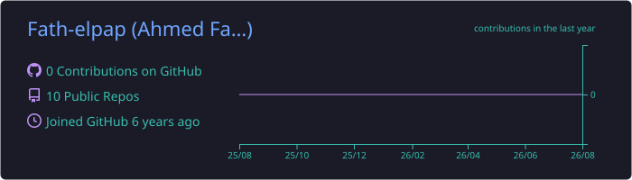
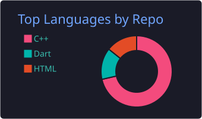

👋 Hi, I'm Ahmed Fath Elpap Mohamed

📊 Mid-Level Data Analyst

Power BI • SQL • Python • Excel • DAX • Power Query

 

  

About •Toolkit •Workflow •Projects •Analytics •Contact

👨‍💻 About Me

I'm a Mid-Level Data Analyst focused on transforming raw data into clear, actionable business insights.

I work across the analytics lifecycle — from data preparation and exploratory analysis to data modeling, KPI development, dashboard design, and business recommendations.

My approach is simple:

Understand the business question → prepare the data → analyze the drivers → communicate the insight → support the decision.

<b>🎯 What I Focus On</b>

 

Building decision-focused Power BI dashboards

Writing SQL queries for business analysis

Cleaning, analyzing, and automating data workflows with Python

Developing DAX measures and business KPIs

Transforming data with Power Query

Designing clean and reliable data models

Performing EDA, segmentation, clustering, and pattern analysis

Turning findings into clear business recommendations

🛠️ Analytics Toolkit

Choose a toolkit to explore 👇

<b>📊 Business Intelligence & Visualization</b>

 

  
  
  
  

What I do with them

📈 Build interactive executive dashboards

🎯 Design KPI-driven reports

🧮 Create advanced DAX measures

🔄 Transform and prepare data with Power Query

🏢 Translate business requirements into analytical solutions

<b>🗄️ SQL & Data Management</b>

 

  
  
  
  

Core Skills

🔎 Data extraction and exploration

🔗 Complex joins and relationships

🧠 CTEs and subqueries

📊 Window functions

🎯 Business KPI calculations

🧹 Data quality validation

<b>🐍 Python & Exploratory Data Analysis</b>

 

  
  
  
  

Core Skills

🧹 Data cleaning and preprocessing

🔍 Exploratory Data Analysis

📊 Statistical exploration

📉 Data visualization

⚙️ Analytics automation

🧩 Feature engineering

<b>🤖 Machine Learning & Segmentation</b>

 

  
  
  
  

Use Cases

👥 Customer segmentation

📦 Product segmentation

🎯 Behavioral clustering

📊 RFM analysis

🔬 Cluster interpretation

💡 Converting model outputs into business segments

<b>🧱 Data Modeling & ETL</b>

 

  
  
  
  

Core Skills

🧱 Star-schema design

🔗 Table relationships

🧹 Cleaning and transformation

✅ Data validation

📐 Analytical data modeling

⚡ Model optimization

🎯 My Core Stack

  

Tools are only part of the process — the real goal is turning data into decisions.

🚀 Featured Projects

Selected analytics projects focused on business intelligence, reporting, and decision support

 

<table>
<tr>
<td width="50%" valign="top">

🛒 Olist E-Commerce Business Intelligence Analysis

Retail Analytics

End-to-end Power BI solution analyzing Olist's e-commerce operations across executive, sales, product, and customer dashboards.

 

Tech Stack

  
  
  
  

</td>

<td width="50%" valign="top">

☕ Coffee Sales Analysis

Retail Analytics

Interactive Excel dashboard analyzing coffee shop sales performance across 2024 and 2025 with payment and product breakdowns.

 

Tech Stack

  
  
  
  

</td>
</tr>

<tr>
<td width="50%" valign="top">

🏪 Store Analysis

Retail Analytics

Executive-grade dashboard focused on the decisions leaders need to make — revenue drivers, profitability, customer targets, and location investment.

 

Tech Stack

  
  
  
  

</td>

<td width="50%" valign="top">

📦 Super Store Analysis

Retail Analytics

End-to-end analytics project with ETL, star-schema modeling, and a modern dark-themed dashboard analyzing sales, returns, and shipping.

 

Tech Stack

  
  
  
  

</td>
</tr>
</table>

📊 GitHub Analytics

  

  

<b>ℹ️ About these analytics</b>

 

These analytics cards are generated through GitHub Actions and stored directly inside this profile repository.

💡 Analytics Philosophy

A dashboard is not the final product. A better decision is.

Good analytics should make it easy to understand:

What changed → Why it changed → What action should follow.

🤝 Connect With Me

